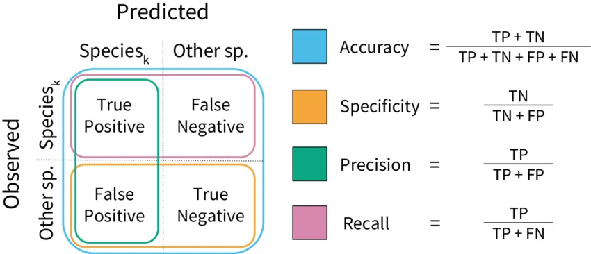

<!-- #image -->

<!-- # UCSD class DSC80 by Trey Scheid and Eduardo Spiegel -->
 

# Introduction

We are students at the University of California, San Diego studying Data Science. This is our first large scale comprehensive project that includes the entire data science lifecycle. 

In this notebook we are going to be analyzing and predicting on a dataset that contains recipes and ratings from <a href="https://www.food.com/" target="_blank">Food.com</a>. In <a href="https://cseweb.ucsd.edu/~jmcauley/pdfs/emnlp19c.pdf" target="_blank">this paper</a>, Bodhisattwa Prasad Majumder\*, Shuyang Li\*, Jianmo Ni, and Julian McAuley scraped Food.com for approximately 180K recipes and 700K interactions[^1]. Our University professors have given us a subset; the combined dataset before cleaning consists of `234,429` interactions on known recipes.

[^1]: <a href="https://aclanthology.org/D19-1613" target="_blank">Generating Personalized Recipes from Historical User Preferences</a> (Majumder et al., EMNLP-IJCNLP 2019)

We are interested in two questions: 

**1. Do people eat more unbalanced food during the winter holiday season?** 
**2. Can we predict if a recipe is balanced without knowing its nutrition information?**

1. 
We asked this question because we feel people tend to eat more unbalanced during these months since there are lots of holidays and special occasions which often include unbalanced food. If we know the answer to this question we can think about, for example: what kinds of advertisements to use in that time, or what to serve at a holiday party! Therefore, to test this hypothesis, we are going to analyze the data from Food.com.

For this we are going to be analyzing the columns `'id'`, `'date'` and `'nutrition'`. The column `'date'` stores the dates in which an interaction was made with a recipe. We will use this date as the date a person ate one of the recipes. Then we will use the column `'nutrition'` to classify each recipe `'id'` as a balanced or unbalanced recipe.

Other columns we might work with during the cleaning process are `'minutes'`,`'submitted'`,`'n_steps'`,`'n_ingredients'`. We will probably use these since they contain relevant information about the recipe that if it's extreme, it could raise some red flags about our data.
 

2. 
For this we are going to analyze the columns `'ingredients'`, `'tags'` and many more to predict `'balanced'`.

Other columns we might work with during and after the cleaning process are `'minutes'`,`'submitted'`,`'n_steps'`, and `'n_ingredients'`. They contain relevant information about the recipe that when extreme, raises some red flags to be explored.

### Datasets[^2]:

_Recipes_

<!-- start table -->

<table><thead><tr><th style="text-align: left">Column</th><th style="text-align: left">Description</th></tr></thead><tbody><tr><td style="text-align: left"><code class="language-plaintext highlighter-rouge">'name'</code></td><td style="text-align: left">Recipe name</td></tr><tr><td style="text-align: left"><code class="language-plaintext highlighter-rouge">'id'</code></td><td style="text-align: left">Recipe ID</td></tr><tr><td style="text-align: left"><code class="language-plaintext highlighter-rouge">'minutes'</code></td><td style="text-align: left">Minutes to prepare recipe</td></tr><tr><td style="text-align: left"><code class="language-plaintext highlighter-rouge">'contributor_id'</code></td><td style="text-align: left">User ID who submitted this recipe</td></tr><tr><td style="text-align: left"><code class="language-plaintext highlighter-rouge">'submitted'</code></td><td style="text-align: left">Date recipe was submitted</td></tr><tr><td style="text-align: left"><code class="language-plaintext highlighter-rouge">'tags'</code></td><td style="text-align: left">Food.com tags for recipe</td></tr><tr><td style="text-align: left"><code class="language-plaintext highlighter-rouge">'nutrition'</code></td><td style="text-align: left">Nutrition information in the form [calories (#), total fat (PDV), sugar (PDV), sodium (PDV), protein (PDV), saturated fat (PDV), carbohydrates (PDV)]; PDV stands for “percentage of daily value”</td></tr><tr><td style="text-align: left"><code class="language-plaintext highlighter-rouge">'n_steps'</code></td><td style="text-align: left">Number of steps in recipe</td></tr><tr><td style="text-align: left"><code class="language-plaintext highlighter-rouge">'steps'</code></td><td style="text-align: left">Text for recipe steps, in order</td></tr><tr><td style="text-align: left"><code class="language-plaintext highlighter-rouge">'description'</code></td><td style="text-align: left">User-provided description</td></tr><tr><td style="text-align: left"><code class="language-plaintext highlighter-rouge">'ingredients'</code></td><td style="text-align: left">List of all ingredients used in recipe</td></tr><tr><td style="text-align: left"><code class="language-plaintext highlighter-rouge">'n_ingredients'</code></td><td style="text-align: left">Number of ingredients in recipe</td></tr></tbody></table>

<!-- end table -->

83,782 rows × 12 columns

 

_Ratings_

<table><thead><tr><th style="text-align: left">Column</th><th style="text-align: left">Description</th></tr></thead><tbody><tr><td style="text-align: left"><code class="language-plaintext highlighter-rouge">'user_id'</code></td><td style="text-align: left">User ID</td></tr><tr><td style="text-align: left"><code class="language-plaintext highlighter-rouge">'recipe_id'</code></td><td style="text-align: left">Recipe ID</td></tr><tr><td style="text-align: left"><code class="language-plaintext highlighter-rouge">'date'</code></td><td style="text-align: left">Date of interaction</td></tr><tr><td style="text-align: left"><code class="language-plaintext highlighter-rouge">'rating'</code></td><td style="text-align: left">Rating given</td></tr><tr><td style="text-align: left"><code class="language-plaintext highlighter-rouge">'review'</code></td><td style="text-align: left">Review text</td></tr></tbody></table>

731,927 rows × 5 columns

[^2]: Data is a subset from 2008 on from the raw data in <a href="https://cseweb.ucsd.edu/~jmcauley/pdfs/emnlp19c.pdf" target="_blank">this report</a>. Column descriptions provided from UCSD DSC80!
<!-- #endregion -->

 
 

# Cleaning and EDA

<!-- Describe, in detail, the data cleaning steps you took and how they affected your analyses. The steps should be explained in reference to the data generating process. Show the head of your cleaned DataFrame -->
In this section of our analysis, we did some pre-processing and applied data cleaning techniques to our data that were coherent with the data generating process. For the pre-processing, we merged the two given datasets on the `'recipe_id'` column. We filled 0's in `'rating'` with `'NaN'`, because when we tried to upload a review to food.com didn't allow us to rate a recipe with 0's. Then, we created a column called `'avg_rating'`, which stores the average ratings per recipe.

For the cleaning process we explored column by column looking for abnormal values. The first column we explored was `'id'`. We checked if this column was unique for every recipe in our dataset and in fact it was. This was an important step for ensuring the correctness of our analysis. Then we went over `'name'`,`'contributor_id'` but since they weren't too relevant to our analysis we didn't pefrom any cleaning. For the `'minutes'` column, we saw a large max number of `'minutes'` and it seemed strange since it's nearly impossible a recipe could take **1 million** minutes to make, so we did some plots of its distribution to decide how to clean it.

<iframe src="assets/visualization_1.html" width=700 height=500 frameBorder=0></iframe>

<iframe src="assets/visualization_2.html" width=700 height=500 frameBorder=0></iframe>

We can visualize that most of the data is centered in a reasonable place, but there are a few data points spread out all over until **1 million** minutes. Since it's really ambiguous how to decide a cutoff to these values, we used a common statistical practice called 1.5xIQR rule developed by statistics to remove outliers. We decided this was a valid technique because most of the values were between the interquartile range, so only the outliers were going to be cutted of.

<iframe src="assets/visualization_3.html" width=700 height=500 frameBorder=0></iframe>

Moving on, we wanted the column `'submitted'` and `'date'` to both be ``DateTime`` objects, so we applied some cleaning to make it  `'DateTime'` objects. Then the `'tags'`, `'nutrition'` and `'ingredients'` columns were stored as strings, so we used some string methods to transform these columns elements into `lists`. We then created separate columns for the values in the `'nutrition'` lists and transformed them from strings to floats. We explored these columns values and found that we had some values that were way out of reality for a single serving size. We explored and found out that the recipes with extremely high calories were either cookies, cakes, breads or turkeys, which all of them are recipes that you usually cook for more than one person. These data was going to cause trouble to our hypothesis testing, so we neede to find a way to cut it off. First lets visualized the distribution of `'calories'`, so we can decide how we are going to perform the cutoff.

<iframe src="assets/visualization_4.html" width=700 height=500 frameBorder=0></iframe>

<iframe src="assets/visualization_5.html" width=700 height=500 frameBorder=0></iframe>

In the histogram above, we can observe that most of our data is concentrated in one point, and there are a bunch of other spread through until `45,000 calories`. So we applied the same technique we used for `'minutes'`. We decided this was a valid technique because most of the values were between the interquartile range, so only the outliers were going to be cutted of.

<iframe src="assets/visualization_6.html" width=700 height=500 frameBorder=0></iframe>

At this point we had most of our data cleaned, but we kept exploring the last columns. Althoug most of these values were within a reasonable range, the `'sodium'` column `max` seemed pretty extreme, so we explored it. We got that the extreme values came from recipes of types of salts which is a reasonable explanation to their high levels of `'sodium'`, so we decided to keep them in our dataset.

We already went through most of the columns, but we still needed to check the `'user_id'` column. There was one row in the `'user_id'` column which contained `NaN`. Since this row didn't provide any information to our data we decided to drop it. Our last column to check was `'rating'`. We checked if its values were positive integeres in the range `[1,5]` since those are the possible ratings for a recipe, and indeed they were, so no cleaning was made.

Finally we added a column that classified our recipes as `'balanced'` or `'unbalanced'`. According to the FDA, meals should contain between `5%` to `20%` of the percentage of daily value (PDV). We used this to classify our recipes in `'balanced'` and `'unbalanced'` categories.

Source: https://www.fda.gov/food/new-nutrition-facts-label/lows-and-highs-percent-daily-value-new-nutrition-facts-label

In summary, we explored the data generating process of this dataset from bottom to top, and used this information to decide which values were coherent with it and relevant to our analysis. We filtered out all values that weren't relevant, and classified those who were in order to perform analysis in the future.

 

### Dataset

Here are the first few rows of the cleaned interactions dataframe[^3]:

<iframe src="assets/sdatahead.html" width=900 height=210 frameBorder=0 title="cleaned dataset preview"></iframe>

198,461 rows × 24 columns

[^3]: We only show a preview of some columns for the sake of space and formatting when they are not essential to our understanding of the dataset or the analysis. 
<!-- <iframe src="assets/df2.html" width=1000 height=600 frameBorder=0></iframe> -->

 

#### Univariate Analysis

We wanted to explore the distribution of interactions among all recipies. We thought this was an interesting analysis since we could start drawing lots of experiments from it.

<iframe src="assets/visualization_7.html" width=700 height=500 frameBorder=0></iframe>

As we observe, there is a decrease in interactions over the years according to this visualization, but we can also appreciate a spike in many of the June's throughout the years. Why this happens is a really good question. After observing this plot, we were curious about the  distribution of recipe's submissions throughout the years, so we decided to visualize it too.

<iframe src="assets/visualization_8.html" width=700 height=500 frameBorder=0></iframe>

This is a really insightfull visualization since we can observe how the amount of submissions decreased over the years from thousands of recipes submitted per month to less than 50 per month. 
 
 

#### Bivariate Analysis

Sometimes the best food we eat is the one with the most calories. Although that's quite a shame, we wanted to see if that's true in our data. We wanted to analyze the relationship between `'rating'` and `'calories'`. For this we plotted a horizontal bar chart to show the `mean of calories per star rating`.

<iframe src="assets/visualization_9.html" width=700 height=500 frameBorder=0></iframe>

This is quite surprising since it goes against our intuition. We thought food with more calories would have more ratings but apparently is completely opposite from what we thought. Even though almost all means are the same, we can see an inverse proportionate trend with respect to ratings.

We then observed the relationship between mean of calories consumed per month of the year.

<iframe src="assets/visualization_10.html" width=700 height=500 frameBorder=0></iframe>

There appears to be a trends in the data. The months February, March, September and October have quite a peak compared to the rest of the months. It could be quite interesting to anlyze more in depth what are the reasons of this.

Another bivariate analysis we worked on is the distribution of calories between `'balanced'` and `'unbalanced'` recipes. We plotted a histogram with a marginal box plot to see the difference in distributions.

<iframe src="assets/visualization_11.html" width=700 height=500 frameBorder=0></iframe>

We can observe that there is a signifficant difference in the distributions of calories of balanced and unbalanced recipes. Most of the balanced recipes are centered around 200 while the unbalanced recipes are more skewed to the right.
 
 

#### Interesting Aggregates

One interesting aggregate we thought of was the mean of all columns for balanced and unbalanced recipes. For this we needed to groupby recipe, but we already did that, so we are going to use our `'unique_id_df'` to groupby the `'balanced'` column.

<table border="0" class="dataframe" style="width:90%"><thead><tr style="text-align: right;"><th></th><th>minutes</th><th>n_steps</th><th>n_ingredients</th><th>avg_rating</th><th>calories</th><th>total_fat</th><th>sugar</th><th>sodium</th><th>protein</th><th>saturated_fat</th><th>carbohydrates</th></tr>    <tr><th>balanced</th><th></th><th></th><th></th>      <th></th><th></th><th></th><th></th><th></th><th></th><th></th>      <th></th>    </tr>  </thead>  <tbody>    <tr><th>False</th><td>37.288474</td><td>9.720619</td>      <td>9.037901</td><td>4.630582</td><td>322.656586</td><td>0.237330</td><td>0.469933</td>      <td>0.229876</td><td>0.268985</td><td>0.295157</td><td>0.101728</td></tr>    <tr>      <th>True</th><td>39.719638</td><td>10.237726</td><td>9.284238</td><td>4.611692</td>      <td>200.788889</td><td>0.111835</td><td>0.117106</td><td>0.119289</td><td>0.117946</td>      <td>0.108475</td><td>0.088152</td></tr>  </tbody></table>

We can compare the values of all the columns. First, we can see that the `'avg_rating'` for each one is quite similar which sounds fair. Then, the `'calories'` column do shows a signifficant difference between them. The `'unbalanced'` recipes have a mean of `322.66` while the balanced recipes have a mean of `200.79`. Finally the rest of the columns, unbalanced recipes is much greater to all of balanced recipes, with the `'carbohydrates'` column being the closest one to the blanced recipes mean.

Another aggregate we did was the mean of all columns for ratings of recipes. We groupby ratings in our data DataFrame and aggregate all columns using the mean.

<table border="0" class="dataframe" style="width:90%">
  <thead>
    <tr style="text-align: right;">
      <th></th>
      <th>minutes</th>
      <th>n_steps</th>
      <th>n_ingredients</th>
      <th>calories</th>
      <th>total_fat</th>
      <th>sugar</th>
      <th>sodium</th>
      <th>protein</th>
      <th>saturated_fat</th>
      <th>carbohydrates</th>
      <th>balanced</th>
    </tr>
    <tr>
      <th>rating</th>
      <th></th>
      <th></th>
      <th></th>
      <th></th>
      <th></th>
      <th></th>
      <th></th>
      <th></th>
      <th></th>
      <th></th>
      <th></th>
    </tr>
  </thead>
  <tbody>
    <tr>
      <th>1.0</th>
      <td>38.037634</td>
      <td>10.156362</td>
      <td>8.717742</td>
      <td>314.147939</td>
      <td>0.224610</td>
      <td>0.569194</td>
      <td>0.250883</td>
      <td>0.224888</td>
      <td>0.292706</td>
      <td>0.109933</td>
      <td>0.012097</td>
    </tr>
    <tr>
      <th>2.0</th>
      <td>38.960128</td>
      <td>10.219564</td>
      <td>9.004785</td>
      <td>328.388357</td>
      <td>0.236273</td>
      <td>0.508814</td>
      <td>0.235986</td>
      <td>0.258788</td>
      <td>0.309495</td>
      <td>0.110404</td>
      <td>0.009038</td>
    </tr>
    <tr>
      <th>3.0</th>
      <td>37.530426</td>
      <td>9.578262</td>
      <td>9.008114</td>
      <td>323.329665</td>
      <td>0.230914</td>
      <td>0.451915</td>
      <td>0.223435</td>
      <td>0.278932</td>
      <td>0.289329</td>
      <td>0.104074</td>
      <td>0.013185</td>
    </tr>
    <tr>
      <th>4.0</th>
      <td>36.021115</td>
      <td>9.325153</td>
      <td>8.938727</td>
      <td>319.878731</td>
      <td>0.228987</td>
      <td>0.417097</td>
      <td>0.223185</td>
      <td>0.282177</td>
      <td>0.280962</td>
      <td>0.101275</td>
      <td>0.012066</td>
    </tr>
    <tr>
      <th>5.0</th>
      <td>35.875719</td>
      <td>9.593679</td>
      <td>8.884717</td>
      <td>317.598039</td>
      <td>0.237551</td>
      <td>0.449384</td>
      <td>0.239469</td>
      <td>0.263811</td>
      <td>0.297464</td>
      <td>0.098186</td>
      <td>0.012037</td>
    </tr>
  </tbody>
</table>

5 rows × 11 columns

It's interesting to see that that there is an inverse relationship between `'rating'` and `'minutes'`. Same happens with `'rating'` and `'n_steps'`. The rest of the columns doesn't seem to have much trends at all.

 
 

# Assessment of Missingness

**Percent Data Missing**

|:------------|----------:|
| description | 0.0524032 |
| rating      | 5.94474   |
| avg_rating  | 1.06822   |

This summary shows us that of the relevant columns we are still working with, there are 3 columns with missing data. 2 are from the original dataset but we added `'avg_rating'`. We will look deeper into `'rating'` and `'description'`. But we should notice that none of them have relatively many datapoints missing.

First we can quickly explain `'avg_rating'`

Looking at the other Columns with missing data, we know avg_rating was calculated by aggregating the ratings for each recipe, so any missingness here is __Missing by Design__ based on missingness in the rating column. We can perfectly and exactly determine the missingness of `'avg_rating'` by checking if any interactions are missing a `'rating'` for each recipe (grouping by `'id'`). 
 
 

#### NMAR Analysis

We do not believe that the missingness mechanism for either is not missing at random, or NMAR. That would mean that some quality of the missing data (the value itself) determines the probability of its missingness. 

- For `'description'` there is no obvious or reasonable quality such as sentiment or length that would relate to its missingness. 

- `'Rating'` is more complicated. Users interacting with a recipe can either leave a review with a rating, or just a comment with no rating. This means some users may be commmenting without having even tried the recipe, that means for that interaction no rating value exists or should exist. This rules out NMAR.

Here is an example of an interaction without a rating, it happens to be for someone who tried the recipe and loved it. We can imagine this is also likely for someone who hasn't tried it or tried it and did not like it. 

<!--  -->
 
 

#### Missingness Dependency

Neither `'description'` nor `'rating'` is closely related to the guiding question of unhealthy foods during the holiday season. However we will still investigate if they are missing dependent on another column (MAR) or if they are missing completely at random (MCAR). 

First we will explore missingness in `'description'`:

We believe it is plausible that if a `'description'` is missing then it is likely the author did not put in much effort to their post and the recipe will not be as good. This line of thinking would mean the `'avg_rating'` on that recipe would probably be lower for those that are missing. That would make `'description'` MAR on `'avg_rating'`. We can test this hypothesis with a permutation test. 
 
 

**Avg_rating**

We perform a Permutation Test to see if missingness of description column is conditional on `'avg_rating'`. We will end up repeating this process for many columns following. Description is unique to a recipe but duplicated for each interaction, we want to know how it relates to the recipes so we must retrieve that data again by grouping the interviews for each recipe together. We need to work with only the non-null rows of the data in avg_rating otherwise no statistic could be computed.

###### Choosing a Test Statistic

`'avg_rating'` is a quantitative variable which gives us two main options. We should use the difference of means for missing and not missing `'description'` if the distribution of `'avg_rating'` is roughly the same shape but shifted. If the shape is different and distributions are centered in the same place we should use the Kolmogorov-Smirnov statistic. 

<iframe src="assets/visualization_12.html" width=700 height=500 frameBorder=0></iframe>

As we can see the distributions are centered at roughly the same location but their shapes are pretty different. This means we will use the Kolmogorov-Smirnov test statistic and run a permutation test to see if `'description'` is MAR on `'avg_rating'`.

* Permutation Test for MAR of Description on `'avg_rating'`
* Test Statistic: Kolmogorov-Smirnov
* Alpha level: 5%
 

_Results_  
z-score:  3.33  
p-value:  0.938  
Reject Null:  False  
 

##### Results

We can interpret the results of the Kolmogorov-Smirnov permutation test as follows. Under the assumption that `'description'` is unrelated to the distribution of `'avg_rating'`, the chance of seeing distributions as, or more, different than our two observed `'avg_rating'` distributions is 93.8%.

This is above our alpha threshold of 5% so we **fail to reject the null**. This means that the missingness of `'description'` is unlikely to be related and or condional to the distribution of `'avg_rating'` and that we have no evidence to say that it does (we also have no evidence to say it is unrelated for sure).

This would mean `'description'` is not MAR upon `'avg_rating'`.

This also indicates that our intuition was incorrect, lets test another column, `'user_id'`.
 
 

**User_id**

User_id is a categorical variable which means that we should use the total variation distance for a test statistic. This is calculated as the sum of the differences by category, divided by 2. It describes the distance between two categorical distributions. 

* Permutation Test for MAR of Description on `'User_id'`
* Test Statistic: TVD
* Alpha level: 5%

The last test statistic was calculated using a python library and immediately gave the results. Now we will run the permutation test with our own simulation. To do that we calculate many TVDs, one for each shuffle of `'user_id'`, this is done because under the null the missingness of `'description'` does not depend on `'user_id'` so the pairings are arbitrary. We will then compare our observed TVD to these. The observed test statistic is the TVD calculated on the actual sample from the data without any shuffling.

<iframe src="assets/visualization_13.html" width=700 height=500 frameBorder=0></iframe>

The graph gives an idea of how usual or abnormal our observed TVD is compared to permutations under the null. It shows a histogram of all the TVDs when `'user_id'` doesn't influence `'description'` missingness. We get an exact measure of how many TVDs are as or more extreme when we calculate the p-value. The p-value turned out to be 0.359.

##### Results

We can interpret the results of the TVD permutation test as follows. Under the assumption that `'description'` is unrelated to the distribution of `'user_id'`, the chance of seeing distributions as, or more, different than our two observed `'user_id'` distributions is 35.9%.

This is above our alpha threshold of 5% so we **fail to reject the null**. This means that the missingness of `'description'` is not likely to be related and or condional on `'user_id'`. Consequently we cannot say `'description'` is MAR upon `'user_id'`.

Lets try another, there might be one or more that are dependent, if we find even one that is MAR we would consider the missingness in `'description'` to be MAR, if we _fail_ to reject the null for every column then we default to MCAR. Lets test `'calories'` against `'description'`.
 
 

**Calories**

Need to choose a test statistic, so need to see if the distribtutions of `'calories'` with and without `'description_missingness'` are shifted versions (diff of means) or same center and diff shape (Kolmogorov-Smirnov)

<iframe src="assets/visualization_14.html" width=700 height=500 frameBorder=0></iframe>

We see that the means are closely aligned, The shapes are also pretty similar but the height of the curve and the level it dips are different so we will try Kolmogorov-Smirnov statistic.

_Results_  
z-score:  202.3  
p-value:  0.506  
Reject Null:  False  

That did not result in significant results, we **fail to reject the null**. Before we interpret and conclude, lets test the difference in means as well. 

<iframe src="assets/visualization_15.html" width=700 height=500 frameBorder=0></iframe>

Once again, the graph gives an idea of how usual or abnormal our observed difference of means is compared to permutations under the null, we get an exact measure of how many differences are as or more extreme when we calculate the p-value: 0.169.

##### Results

We can interpret the results of both permutation tests. Under the null assumptions where missingness of `'description'` is unrelated to the distribution of `'calories'`, the chance of seeing a mean difference or Kolmogorov-Smirnov, or more, different than observed is 16.9% and 50.6% respectively.

These are above our alpha threshold of 5% so we **fail to reject the null** twice. This means that the missingness of `'description'` is not likely to be related and or condional on `'calories'`. Once again we cannot say `'description'` is MAR upon `'calories'`.

We will skip checking each column individually but that is the process to check for MAR vs MCAR. 

 
 
Next we will explore missingness in `'ratings'`:

This means we need the whole data dataframe since this involves each interaction not only each unique recipe. We will check `'calories'` first. Its a stretch but since we have a hunch about unhealthy foods being more popular in the holiday season, maybe more calories relates to lower ratings and therefore missing ratings. \*Note even a rejected null could not prove this or any theory because it is not evidence of causation.

<iframe src="assets/visualization_16.html" width=700 height=500 frameBorder=0></iframe>

<iframe src="assets/visualization_17.html" width=700 height=500 frameBorder=0></iframe>

Once again, the graph gives an idea of how usual or abnormal our observed difference of means is compared to permutations under the null, we get an exact measure of how many differences are as or more extreme when we calculate the p-value:

_Results_  
z-score:  387.5  
p-value:  8.9e-08[^4]
 
Reject Null:  True  
 

##### Results

We can interpret the results of the Kolmogorov-Smirnov permutation test as follows. Under the assumption that `'ratings'` is unrelated to the distribution of `'calories'`, the chance of seeing distributions as, or more, different than our two observed `'calories'` distributions rounds to 0%.

This is below our alpha threshold of 5% so we **reject the null**. This means that the missingness of `'ratings'` is likely related and or condional to the distribution of `'calories'`. This means `'ratings'` is MAR upon `'calories'`.

[^4]: This is scientific notation for 9 × 10^-8 which is very close to 0

 
 

**total_fat**

<iframe src="assets/visualization_18.html" width=700 height=500 frameBorder=0></iframe>

* Permutation Test for missingness of Rating on `'total_fat'`
* Test Statistic: Kolmogorov-Smirnov
* Alpha level: 5%

_Results_  
z-score:  0.37  
p-value:  2.7e-06  
Reject Null:  True  

We got another significant result for MAR on `'rating'`. Lets see one more column unrelated to the original `'nutrition'` column to see if it is also MAR.
 
 

**name**

* Permutation Test for missingness of Rating on `'name'`
* Test Statistic: TVD
* Alpha level: 5%

<iframe src="assets/visualization_19.html" width=700 height=500 frameBorder=0></iframe>

##### Results

For a third time we **reject the null** and this time with a p-value 0.00! Missingness of `'rating'` is dependent on yet one more of many other columns. 
 
 

### Missingness Notes

While assessing missingness for the recipes and interactions data we found that missing descriptions are not missing at random by `'avg_rating'`, `'user_id'`, or `'calories'`. We did not find any columns that it was MAR for. For the `'rating'` column we found the opposite, it was missing at random on `'calories'`, `'total_fat'`, and `'name'`. We are not using either column for our hypothesis test so no imputation or drops are necessary.

 
 
 

# Hypothesis Testing
 

Guiding Question: **Do people eat more unhealthy food during the winter holiday season?**

Interpretation according to available data: Do people interact more with unbalanced recipes from October to December than the rest of the year? Remember unbalanced recipes are our equivalent of unhealthy.

* Variables: `'month'` and `'balanced'`

* Test Statistic: _proportion of recipes that are **not** balanced_

* alpha level: 0.01 significance level'

This proportion will be able to show us how popular balanced food is in comparison to unbalanced foor in any given month without being affected by individual recipes (such as high calories) or varying amounts of interactions in each month (proportions are relative). The 1% significance level will help us be more confident in the answer to our question should we reject, we are limiting the probalility of a type I error which is incorrectly rejecting the null. 
 
 

**Hypotheses**

* _Null Hypothesis:_ proportion of unbalanced recipes from October to December is **equal to** the proportion of all unbalanced recipes
* _Alternative Hypothesis:_ proportion of unbalanced recipes from October to December is **greater than** the proportion of all unbalanced recipes
 

Lets check how the proportion of unbalanced recipes varies by year in case we should split up our hypothesis test. 

<iframe src="assets/visualization_20.html" width=700 height=500 frameBorder=0></iframe>

We notive that there is a dip followed by a spike in the last three years, this data could be more variable since as we saw in the EDA there are much fewer recipes interacted with in the last few years. For this reason we will continue with the hypothesis test on all of the data together regardless of year. 

 

_Now we perform the hypothesis test:_

Just like with the permutation tests for missingness earlier, we have a distribution of test statistics, in this case proportions of unbalanced recipes. We can compare the proportion of unbalanced recipes from only the Holiday months which we are interested in compared to the general. 

We use simulation to create an empirical distribution of proportions of interactions on unbalanced recipes under the null hypothesis. This means random sampling with replacement from all the rows (including all the months) and calculating the proportion of interactions on unbalanced recipes for each repetition.

Our observed test statistic is found by calculating the proportion of interactions on unbalanced recipes from the months October, November and December only yields 0.988. Here is a plot of the comparison:

<iframe src="assets/visualization_21.html" width=700 height=500 frameBorder=0></iframe>

The empirical distribution of proportions of interactions on unbalanced recipes shows all the probable proportions expected assuming the winter holiday season has no effect. We calculate a p-value of 0.6197 given our observed proportion.
 

##### Results

Under the assumption that `'balanced'` or healthiness of a recipe is unrelated to the `'month'`, the chance of seeing a proportion of unbalanced recipes __in any three month period__ as or more extreme than the observed proportion of unbalanced recipes in the holiday season is 62.0%.

This is above our selected significance level so we **fail to reject the null**. Our observed proportion was not unlikely under the null, which means our observation is consistent with the hypothesis that being the winter holiday season does not relate to unbalanced recipe interactions. This also means that our intuition was not supported and we cannot say based on the data that people eat more unhealthy food during the winter holiday season. 

This was not the result we expected, however it does make us wonder if any one specific month or week would be significant. That any many more questions will have to be explored another time. 

 
 
 

# Framing The Problem

Now we will move on to our second quesion. This is a binary classification problem since our response variable has only two outputs True or False; a recipe is either balanced or not balanced. The EDA defines balanced recipes as ones that have nutrition info from 5-20% Daily Value. We will explore that further shortly.

__Importance:__ There is practical use in knowing if a recipe is balanced or not. Things like ingredients and steps are common information about a recipe that even your grandmas best will have. Nutritional specifics are not as easy to get and thus may not always be available, in such a case if we can predict if it would still be a balanced recipe then you can make healthy recommendations. This might be done in an app or website with a search feature and a "healthy" tag or something similar. 

__Metric:__ We think it is more important that we don't incorrectly classify a recipe as balanced when it is not, this might lead to recommendations to people for healthy recipes that are not actually healthy! These cases we want to avoid are false positives so we want to maximize precision. Some other metrics such as accuracy are missing a level of detail while the rest are including things that aren't critical such as false negatives in confusion matrices and F1 scores. 

We will not be using any interactions (`'review'` or `'avg_rating'`) on the recipes since these are posted onto the recipe after they are posted to Food.com, we would like to classify before users try the recipes!

 

### Balanced Recipes

In this project we are primarily concerned with the healthiness of a recipe, more scientifically we describe it as "balanced". The US government's Food and Drug Administration has guidelines on what makes a food healthy. We will review this then create our own specific definition.

>Under the new guidelines, something that is “healthy” needs to have the equivalent of a serving of fruits, vegetables, grains, dairy or protein foods as indicated in the Dietary Guidelines for Americans. Raw, whole fruits and vegetables automatically can bear the claim. There is a scale for different kinds of prepared products that has a nutrient requirement and percentage limits for the recommended daily intakes of added sugars, sodium and saturated fats.  
This definition, which has been six years in the making, is a comprehensive and multifaceted way to handle the label claim, which many consumers would readily accept as an indicator that a food item is unequivocally good for them.
https://www.fooddive.com/news/fda-healthy-definition/632661/

>FDA regulates about 78 percent of the U.S. food supply. This includes everything we eat except for meat, poultry, and some egg products.
https://www.fda.gov/about-fda/fda-basics/fact-sheet-fda-glance

(USDA regulates the rest, they have their own <a href="https://www.fooddive.com/news/usda-sets-parameters-for-items-labeled-healthy/574387/" tag="blank_">rules</a> for healthy items)

According to the FDA, meals should contain between `5%` to `20%` of the percentage of daily value (PDV). 

https://www.fda.gov/food/new-nutrition-facts-label/lows-and-highs-percent-daily-value-new-nutrition-facts-label

We will alter it slightly to better represent what is generally percieved as healthy and the more recent definition by the FDA. That means less than 5% sugar or fat is good, and greater than 20% protein is also healthy. We added a column to the data which is True or False based on the information from the nutrition column. 

 

### Additional Cleaning

While cleaning before, we checked out the distribution in many columns performing datatype conversions, outlier removal and think about the true data generating process while we do it.

We looked closer into the ingredients column since it will be important for our prediction.

We have seen that many ingredients are written in their plural and singular forms. This underrepresents their prescence in recipes since their count is distributed as two different ingredients. Therefore, to fix this we decided to strip all letters "s" from the end of the ingredients. For example this combined 'egg' and 'eggs' into one column 'egg'. 

We will keep only one row per unique recipe and remove the interactions related data to leave us with this: 

<iframe src="assets/pred_bal_df.html" width=900 height=210 frameBorder=0 title="cleaned dataset preview"></iframe>

70,550 rows × 10 columns

 
 

# Machine Learning: Classification

__The Process__:  
We will choose some _features_ that we think apply best to predicting `balance` of a recipe, then _train_ a few models using the default hyperparameters. Once we see their precisions (calculated using a test dataset we set aside) we will _tune_ the best one or two models, depending on how similar their scores were, and try to train the best model possible. Tuning will involve _cross validation_ with a randomized/grid searches of possible combinations of hyperparameters. Finally we will have a model fitted on the full dataset you can try on your own! 

Keep in mind, if a _simple_ solution works as well as a complicated one the simple solution is preferred. Thats why we will start with few features and slowly add more checking for improved performance.

 

### Feature Selection

We must remove columns that are ineligible according to the data generating process (GDP).

Our model should be used to predict the balanced label as `True` or `False` given information about the recipe except the nutrition. We are assuming we won't have any `'review'`s on it (under different assumpotions you could create a model for that as well). This allows us to prepare for the person uploading can be someone new to Food.com or not. If our model trained on previous `'contributor_id'`'s this may help if existing users post new recipes but not for general cases and new users, therefore we will overfit! The `'nutrition'` info itself is equivalent to creating balanced so that must also be removed.  

`'Name'`, `'submitted'`, `'steps'`, and `'description'` all cannot be directly used in the model because they will lead to overfitting, they are generally too unique to each recipe but we may be able to create features using them!

We will create these features using the sci-kit learn package transformers and drop the remaining columns in the pipeline!

Checking for missing data we found only one column we are using had missing values: `'description'`. We will remove the recipes missing a description because there are so few.

 

 

# Baseline Model

For the base model we will start simple.

Standardize (quantitative):
- minutes
- n_steps
- n_ingredients

One hot encode the unique values in the ingredients list (categorical)

 
### Data

A good practice for a classification problem is to inspect your training data by class. We checked and found that only 10% of the recipes in our dataset are balanced!

From an unknown online source, "Currently, about 5 percent of all packaged foods are labeled “healthy,” according to the agency." So we shouldn't worry that our recipes dataset was biased in this regard.

Even though it reflects reality this is a severe imbalance in classes that still poses a problem for our models. They have less data to train on in the most important category. Our performance measure precision should not be as affected by this like accuracy would, however we still need to address it. There are three ways to deal with the imbalance. 
1. Get more data (ideal, but not an option)
2. Use a model that naturally deals with the imbalance
3. Resample our training data to have equal sized classes through under or oversampling methods. 

We will try 2 and 3, but we need to do a few things first.

First thing we must do, set aside a testing dataset. This is paramount, we can then test our models as we go on unseen data which will give us a better picture on how well it generalizes! We are splitting 15% for testing and made sure the split was stratified to ensure both sets have appropriate class balances that reflect the whole sample we were given. 

`size of training set:  59967` 
`size of test set:  10583`

 

### Preprocessing

Second, build a preprocessing pipeline. This is a lot to look at so we will break it down, which is the whole idea of a pipeline to streamline the process but keep it manageable. Looking top-down at our pipeline there is a split for the categorical vs quantitative variables (the ones we want are used and the other columns dropped). Then the next level we standardize all the quantitative vars and one hot encode the values in the ingredients list with separate transformers. Standardizing is needed because we don't want minutes having a greater impact on the model simply due to units. Encoding the ingredients lists is an abnormal format which sklearn has a transformer for, but not meant for pipelines from our research, we altered it by creating our own custom transformer class using their encoder the MultiLabelBinarizer under the hood. You will notice we also have two additional transformers on ingredients, these reduce the number of columns/features we keep from the encoder so the model isn't trained on too many columns. The VarianceThreshold will keep only the features with at least some threshold of variance, for a one hot encoded column that means that its neither overly popular or overly rare but somewhere in the middle. The next transformer selects the top percentile of columns by their ability to score well on prediction (usefullness!).

The MultiLabelBinarizer creates a column for each unique ingredient and one hot encodes it for every recipe. Sci-Kit learn does not have pipeline support from our understanding. What we do is save the unique ingredients accross all recipes when fitted, then on all future transforms the output features dataframe will only include those columns (dropping any new ingredients, and adding 0 cols for the unseen ingredients from fit). Our class creates many warnings about fragmentation, thats why we suppressed them, it is not a perfect implementation but we avoided for loops :).

 

### Training

Remember we are going to try two different methods for dealing with the class imbalance. For each we will add a model to the pipeline (by creating a new one and using the preprocessing pipeline within). Then We will fit it with the training data and see how it performs on the testing data. We are doing this with mostly default arguments and then we will pick one that works well to fine tune.

 

_Method 1:_ test models that handle unbalanced data

**Precision Results** 
LogisticRegression     0.13169341532923354 
DecisionTreeClassifier 0.13376383763837638 
RandomForestClassifier 0.1486030089038993 
SVC                    0.14330474934036938 
XGBClassifier          0.0 
SGDClassifier          0.13209915280828366 

Overall the precision is dissapointingly low. Precision is a proportion so it ranges from [0, 1] where 1 would be only correct positive predictions and 0 is none. Almost all the models performed at the same level which makes it difficult to reason why to tune one over another, maybe we will see different results with resampling.

 

_Method 2:_ test models on undersampled data

Both under and over sampling have the goal of training a model on balanced classes so that it can notice and recognize both, but we will still test the precision / performance of each model on the imbalanced true testing set to get the best idea of how it will generalize to unseen data.

Undersampling is when we randomly choose n rows to keep from the larger class (not balanced in this case) so that both our classes for training are of equal size.

Oversampling is similar except to achieve balance we bootstrap (sample with replacement) from the smaller class, balanced, until they are equal sizes.

**Undersampled Precision** 
KNeighborsClassifier      0.12097476066144473 
GaussianProcessClassifier 0.14451656986675776 
 
**Oversampled Precision** 
KNeighborsClassifier      0.12097476066144473 
GaussianProcessClassifier 0.14451656986675776 

Due to "high" precision in comparison to the others, and very fast training time which we observed, we chose the RandomForestClassifier model to continue with and tune. We also did a few runs and some others that performed as well were not as consistent.

 

### Fine Tuning

There are many hyperparameters to tune between the preprocessing pipeline and the Random Forest. Due to time constraints we will perform the searches separately but ideally you would run a grid search checking all the combinations. We also will only use 3 cross-validation folds to limit the amount of training being done.

The searcher takes in a dict of hyperparameters which describe paths down to the correct pipeline item and param then a list of options to try. We will define these then run it. We are using a new Halving grid search that uses subsets of data to narrow its search at the start, with a large dataset and limited compute resources we have to make sacrifices! That and only using 3 cross validation folds, mean that we are less confident in the final parameters that the searcher finds. We also are not going to be giving it many to search through so those other issues may not be as significant anyway. 

_tune preprocessor_ 
{'preprocessor__ingredients__select_percentile__percentile': 100, 
 'preprocessor__ingredients__variance_selector__threshold': 0.004975000000000005} 
 
 The first thing to notice, percentile is 100, so it is saying to keep all the columns. Going forward we will remove this transformer entirely. If we had more time we would test the performance with a seacher that performs SelectPercentile before VarianceThreshold, or simply without it, to see which is better.

**Tuned Precision** 
preproc_tuned 0.4358974358974359 
model_tuned   0.48863636363636365 

Interestingly the preprocessing had a much larger difference, either way in total we see big improvements to precision. This was the goal! We only tuned 3 hyperparameters total, with more resources you could test many more combinations.

Double check results 
True Precision: 0.45121951219512196 
True Recall:    0.03259911894273128 
Accuracy:       0.8919965983180572 

 

When using Random Forests or Decision Trees people often talk about the parameter: max_depth. We checked the forest and found that using auto, the tallest tree has a max_depth of 223. Then we check and found that the forest saw 290 features from the preprocessor when being fit. This isn't a very detailed look but the max_depth does not seem outrageous if it asks on average less than one question per feature. We can safely move on without further tuning the max_depth hyperparameter.

 
 

Eduardo and I were eating some chocolate bites while making this, we decided to see what the prediction would be with some partially made up data. They were Meiji Chocorooms, we tested our model trained on all available data and it predicted that balanced was false, this was correct! There was very high %DV sugar and saturated fat so it was not balanced. This was not as challenging as correctly identifying a balanced recipe so we can give it an example like that as well. We passed in a Spinash Quiche recipe. The butter, heavy cream and cheese put this recipe well over the fat daily value. That makes this recipe not balanced but either prediction would seem reasonable. The model predicted False again, which was correct. This is an excellent example of why our model might struggle when even a human can't decide if the recipe seems balanced. Binary classification in this case always has a correct answer by definition but when using the model we need to remember that theres always a spectrum in reality of how balanced a recipe is.

 

### Base Model Breakdown

After trying many models and many hyperparamters we ended with a Random Forest Classifier using 50 trees and gini. We standardized three quantitative variables: `'minutes'`, `'n_steps'`, and `'n_ingredients'`. We had one categorical variable `'ingredients'` which we used an altered multilabelBinarizer to OneHotEncode each unique ingredient which essentially becomes its own nominal boolean variable. That encoding was tricky because we had to account for there being different pools of ingredients at the time of model fitting on the training data and when transforming to testing data. This also created thousands of columns (almost 10K from training) which using a variance selector we narrowed down to ones with a variance higher than the threshold therefore having an ingredient not too popular or unpopular.

We got two types of results: very low precision with decent recall and accuracy, and mediocre precision with abismal recall and mediocre accuracy. Because the worst mistake we can make is to recommend someone an unbalanced recipe and tell them it is balanced, we are prioritizing precision and tuned or models to optimize that. This came at the expense of only capturing a small portion of all the balanced recipes in our dataset therefore missing out on a lot of healthy recommendations. It is hard to say if there are any patterns in the ones we did or did not capture but that would be cool to explore. Given the 4 input variables (3 considering n_ingredients could be engineered) did not have a ton of information that clearly or directly relates to the GDP from a theoretical perspective I believe the results are somewhat good. Ingredients is almost a great feature, but without knowing the amount of each it is not as valuable. In practice the precisoin is not good enough to be used to make actual recommendations, too many would be incorrect; much work is to be done on our next model! We will go back to the feature engineering stage to see if we can add more to increase precision to a useable and trustworthy level. If our final model still has a very poor precision we will have to think about if sacrificing some amount of precision for a huge gain in recall is worth it, that would mean having a much higher count of balanced predictions with slightly less confidence.

<!-- example viz code <iframe src="assets/visualization_3.html" width=700 height=500 frameBorder=0></iframe> -->
 
 

# Final Model

For our final model we decided to add three specific features. First, the quarter in which the recipe was submitted. We believe that the quarter of submission is a good way of capturing the trends of balanced and unbalanced food consumption during the year. It could be the case that more recipes in quarter 1 tend to be balanced since people are motivated at the beginning of the year.

We also though of adding description length. We decided this because usually recipes with longer description tend to be more elaborate which most of the time tend to be more unbalanced compared to simple recipes that don't require that much description. Think about it, you can it's natural to give a much longer description to a cookie sundae than to a plate of chicken and rice.

The third one was the tag column which we applied the same process as we did for the ingredients column. We thought it was important to add this column because some of the tags were like `'dietary'` that could cluster these recipes into groups that might be balanced or unbalanced.

In general adding these features helped us capture more information of the data generating process that we consider helpful for our model. Another technique we used was OneHotEncoding and PCA. We used these techniques because OHE helped us get information from a list of strings while PCA summarized all this information into fewer columns. Reducing the dimensionality of our data improved a lot our model in all the aspects.

We decided to keep using RandomForestClassifier() as our model based on the previous experimentation from the baseline model section.

> A random forest is a meta estimator that fits a number of decision tree classifiers on various sub-samples of the dataset and uses averaging to improve the predictive accuracy and control over-fitting. The sub-sample size is controlled with the max_samples parameter if bootstrap=True (default), otherwise the whole dataset is used to build each tree.
Source: <a href="https://scikit-learn.org/stable/modules/generated/sklearn.metrics.ConfusionMatrixDisplay.html" target="_blank">
scikit learn</a>

 We chose to use the following hyperparameters:

 PCA(n_components = 8)

 RandomForestClassifier(n_estimators = 32, criterion = 'gini', class_weight='balanced')
 
 We got these values from several grid searches that we performed to optimize the precision of our predictions. It's important to remember that we optimized for precision since we believe that recommending a recipe as balanced when it actually is unbalanced can mislead to several health issues in the future. Our final model's precision is 0.50% while our baseline model's was 0.45%. This might not seem too much, but with the data we had available we consider that it's a really good precision. The trade off was that every time we increased our precision, our recall went down, but the score was usually constant around 89%.

 

# Fairness Analysis

For our fairness analysis we are going to analyze the `precision parity` of the recipes with the `'occasion'` tag and the ones without it. Therefore, our Group X is recipes with the `'occasion'` tag, and Group Y is the recipes without the `'occasion'` tag, all these coming from the X_test data.

Our hyposthesis for this analysis are the following:

- **Null Hypothesis**: The classifier's precision is the same for recipes for occasions and not, and any differences are due to chance.
- **Alternative Hypothesis**: The classifier's precision is different for occasions and not.
- **Test statistic**: Absolute difference in precision (between Group X and Group Y).
- **Significance level**: 0.05

For the results we got a p-value of 0.70. In conclusion, we fail to reject the null hypothesis. Therefore, we can't say our model is unfair between the recipes with `'occasion'` tag and the ones without it.

 
 

**Other Questions You Could Explore:**
- What are the healthy/unhealthy food recipe trends over the year?
- More specifically: Have low fat low sugar recipes become more or less common over time? What about seasonally?
- Which ingredient is the most unique with the highest rating?
- Are healthy foods rated higher or lower?
- Over time have there been a higher or lower proportion of healthy recipes posted?
- can we find trends on when a specific recipe is or will be popular, what about general trends accross recipes?
- Are recipes that do not require an oven less healthy?
- Does the sentiment of a review correlate positively with the rating?
- Which ingredients have become more popular since COVID

 
 

Disclaimer and Fun Fact! We initially had a naive definition of 'balanced' where we took the FDA tip literally and restricted all the %DV's to be in the range 5-20. This resulted in a severly imbalanced dataset with <2% of recipes qualifying as balanced. Not only was this unrealistic, this was unpredictable and even with fully trained and tuned models we were stuck at 1% precision! Pretty stressful and highlights the importance of how you ask and answer questions related to the GDP :)

# Conclusion

We really enjoyed this project. We would like to encourage other students (everyone is a student) to check out online resources and try to do a project like this on your own with the same or another dataset! Real life data is messy, cleaning was paramount, little changes to outlier removal dramatically changed p-value results in our hypothesis test. It is always good to document your process for replicability and so you ensure your steps are logical. Lastly, **doing it with a friend makes it extra fun!**

Sincerely, 
Eduardo and Trey

P.S.
Check out our other work at our github profiles linked below or send us a message at [trey11sport@gmail.com](mailto:trey11sport@gmail.com) & [eduardo.spiegel21@gmail.com](mailto:eduardo.spiegel21@gmail.com)

 
 

<!-- # #E8E5E1 lightest -->
<!-- # #B9B1A6 lighter -->
<!-- # #5C482F light -->
<!-- # #452E11 header footer medium -->
<!-- # #231709 dark -->
<!-- # #110B04 darker -->
<!-- https://htmlcolorcodes.com/color-picker/ -->
<!-- # #112845 blue complement -->
<!-- # #11452E green complement -->
